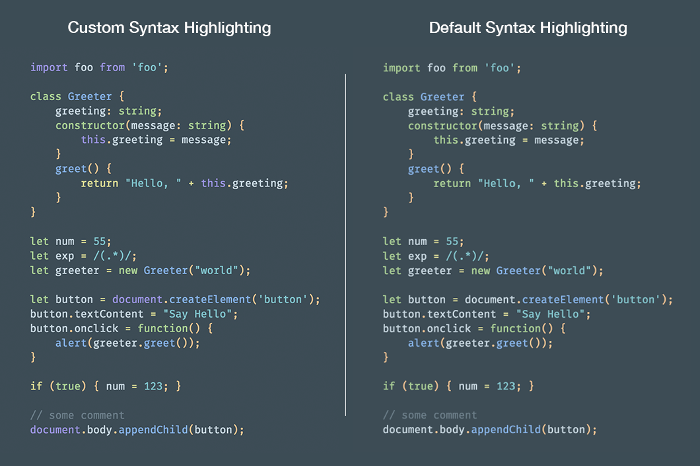

# Spectacle Theme: Nova

A theme for [Spectacle](https://github.com/FormidableLabs/spectacle) based on the awesome color theme called [Nova](http://www.trevordmiller.com/nova/) by [Trevor D. Miller](https://github.com/trevordmiller) :sparkling_heart:


## Installation

```
npm install spectacle-theme-nova
```

## Usage

```jsx
import { Spectacle, Deck, Slide } from 'spectacle';
import createTheme from 'spectale-theme-nova';

const theme = createTheme();

const Presentation = () => (
  <Spectacle theme={theme}>
    <Deck>
      <Slide>...</Slide>
    </Deck>
  </Spectacle>
);
```

- You can choose between the regular Nova colors and a bright (inversed) version. The later will be generated if you call `createTheme` with `'avon'` as argument.
- It is possible to overwrite any setting with yourcustom styles by passing an object as second argument to the `createTheme` function.

**Example:**

```jsx
// Get the "bright" Nova theme
const theme = createTheme('avon');
```

```jsx
// Color the background in slategray
const customStyles = {
  global: {
    body: { background: 'slategray' }
  }
};
const theme = createTheme(null, customStyles);
```

For further information you can also check out the example from this repo.
You'll find the source code [here]():

### Use the un-packted Version

TODO: Use `lib` instead!

## Syntax Highlighting

